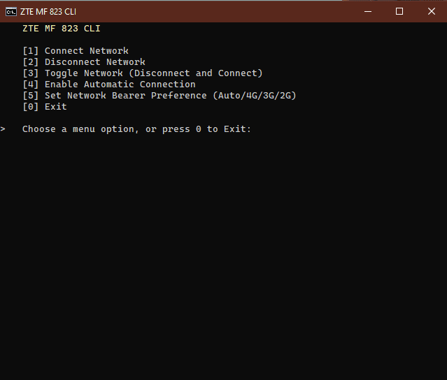
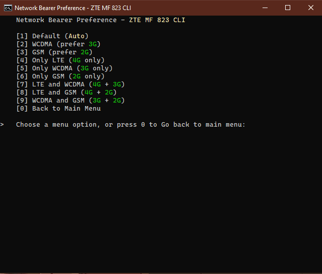

# ZTE MF 823 CLI (Command Line Interface)
A command line interface to interact with ZTE MF 823.

[cURL](https://curl.se/) will be needed to interact with the network address.

## Install cURL
[Earthweb Post](https://earthweb.com/curl/.) 

## Snapshots
|  |
|:--:|
| **Main Menu** |

|  |
|:--:|
| **Sub Menu** | 